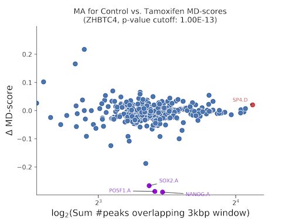
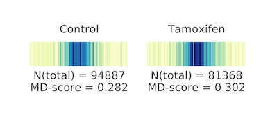

# DAStk

The Differential [ATAC-seq](https://www.ncbi.nlm.nih.gov/pmc/articles/PMC4374986/) Toolkit (DAStk) is a set of command-line tools to aid analyzing differential ATAC-seq data. By leveraging changes in accessible chromatin, we can detect significant changes in transcription factor (TF) activity. This is a simple but powerful tool for cellular perturbation analysis. In fact, the applications of DAStk are not necessarily limited to ATAC-seq, but can extend to comparing any pair of bedGraphs containing regions of interest, e.g. transcription regulatory elements (TRE) from nascent transcription assays like PRO-seq, or others like ChIP-seq peaks.

You will need the following inputs:

- A pair of files listing peaks of ATAC-seq signal in two biological conditions (e.g. DMSO and drug-treated) in any BedGraph-compatible format (tab-delimited)
- A set of files listing the putative binding sites across the reference genome of choice, one file per transcription factor motif, also in any BedGraph-like format. These are normally generated from position weight matrices (PWMs) available at TF model databases like [HOCOMOCO](http://hocomoco11.autosome.ru). These files are expected to have a `.bed`, `.BedGraph` or `.txt` extension.

**IMPORTANT: All files mentioned above (ATAC-seq peaks and computed motif sites) MUST be sorted by the same criteria. Different bioinformatics tools use different lexical sorting criteria (e.g. chr10 after chr1, or chr2 after chr1) so please ensure the sorting criteria is uniform.**

### Install

You can install DAStk using `pip`:

    $ pip install DAStk
    
... or:

    $ pip install --upgrade DAStk 

This is the simplest option, and it will also create the executable commands `process_atac` and `differential_md_score`. Alternatively, you can clone this repository by running:

    $ git clone https://github.com/Dowell-Lab/DAStk.git

### Required Python libraries (automatically taken care of if installed thru `pip`):

* numpy
* argparse
* matplotlib
* scipy
* adjustText
* pandas
* multiprocessing
* pybedtools
* futures
* scikit-learn

These scripts feature comprehensive help when called with the `--help` argument. Every argument provides a short and long form (i.e. `-t` or `--threads`). There are normally two steps in a typical workflow:

1. Process the ATAC-seq peak files (process_atac) to calculate the [MD-score statistic](https://genome.cshlp.org/content/28/3/334.short) for each motif provided.
2. Detect the most statistically significant changes in MD-score (differential_md_score) between both biological conditions (taking into the account the peaks involved), and generate MA and barcode plots.

### TL;DR;

Process each ATAC-seq peak bedGraph file, the genome abbreviations are "hg38", "mm10", etc:

    $ process_atac -e PEAKS_FILENAME_1 -m MOTIF_SITES_DIRECTORY -g GENOME_ABBREVIATION -o OUTPUT_DIRECTORY
    $ process_atac -e PEAKS_FILENAME_2 -m MOTIF_SITES_DIRECTORY -g GENOME_ABBREVIATION -o OUTPUT_DIRECTORY

Perform differential analysis on the calculated motif displacement scores, highlighting the significant motifs at your p-value threshold of choice:

    $ differential_md_score -1 MD_OUTPUT_FOR_FILENAME_1 -2 MD_OUTPUT_FOR_FILENAME_2 -p 0.0000001 -m "DMSO" -n "Drug treatment" -b -o OUTPUT_DIRECTORY

Questions?

    $ process_atac --help
    $ differential_md_score --help
   
### Generating Custom Plots

In the latest release (v0.3.0) two additional modules are now included:

* ma_plot
* barcode_plot

which allow you to generate custom MA and Barcode plots using the data produced using the differential_md_score module. The following will provide usage instructions for each of these plotting tools:

    $ ma_plot --help
    $ barcode_plot --help
    
While these plots will be generated by default when running the differential_md_score module, it may be useful to adjust the labels, adjust the p-value threshold, compare motifs with non-significant p-values etc. The default plots will generate labels based on your file basenames (everything before the \_md\_score.txt extension if you kept the default file names from process_atac). However, to keep plots scaled appropriately, this label is limited to 19 characters. If it is longer, it will be truncated.

### Usage examples

Unpack the motif files (see below for how to create your own, instead):

    $ mkdir /path/to/grch38_motifs
    $ tar xvfz motifs/HOCOMOCO_v11_p1e-6_grch38.tar.gz --directory /path/to/grch38_motifs

Calculate the MD-scores for the first biological condition:

    $ process_atac --threads 8 --atac-peaks /path/to/DMSO/ATAC/peaks/file \
      --genome hg38 \
      --motif-path /path/to/directory/containing/motif/files \
      --output /path/to/output/directory

The above command generates a file called `BASENAME_md_scores.txt`. It's generally a good idea to use the cell type (or sample number) and a brief condition description (e.g. `k562_DMSO` or `SRR1234123_Metronidazole`) in the file name provided.

We would then generate the same file, for the other biological condition we are comparing against:

    $ process_atac --threads 8 --atac-peaks /path/to/treatment/ATAC/peaks/file \
      --genome hg38 \
      --motif-path /path/to/directory/containing/motif/files \
      --output /path/to/output/directory

The above generates a file called `BASENAME_md_scores.txt`. Finally:

    $ differential_md_score --assay-1 DMSO --assay-2 Treatment --p-value 0.0000001 --barcodes --output /path/to/output/directory

The above generates a tab-delimited file with all differential MD scores for each motif and their p-values (sorted by p-value), an MA plot that labels the most significant TF activity changes, at a p-value cutoff of 1e-7. Note that better plot-friendly condition names (say, "DMSO" and "Treatment") can be provided using the `--label-1` and `--label-2` arguments. The plots look like the example below:

The `-b` flag also generates a "barcode plot" of each of these statistically significat motif differences that depicts how close the ATAC-seq peaks were to the (putative TF-binding) motif sites, within a 1500 base-pair radius of the motif center:

If you can take advantage of multiprocessing, you can calculate MD-scores for both conditions simultaneously, assigning several threads to each, then generate the plots once both `*_md_scores.txt` files are ready.

The columns for the tab-separated output file from `differential_md_score` are:

    Motif name , p-value , # peaks in condition 1 , # peaks in condition 2 , MD-score in condition 1 , MD-score in condition 2, fold change
    
## Additional Arguments    

### Genome File

If your genome is not incuded in the UCSC genome repository, you will instead need to provide a chromosome sizes file in processess_atac. This can be generated using [samtools](http://www.htslib.org/doc/samtools.html) faidx as follows:

    $ samtools faidx genome.fa
    $ cut -f1,2 genome.fa.fai > genome.chrom.sizes

This file can then be specified using the -c/--chromosomes argument in process_atac. Scaffold chromosomes will be removed.

### Altering Window Size

While we strongly recommend using the default 1500bp radius window in calculating the MD score (and differential MD score), as of v0.3.0 we now have a radius argument (-r/--radius) which will allow you to expand or shrink this window. If changed, the MD score calculation will follow the same principle in that it will be a ratio of motifs hits within the cetner 1/10th of the window relative divided by the number of total motif hits within the window. For example, if the user specifies a radius of 2000bp, there will be a window size of 4000bp, a center of 400bp around the features of interest, and the MD score will be # motif hits within 400bp/ # motifs within 4000bp. Keep in mind that expanding this window may be useful in visualization, but will result in an MD score approaching 0.1 (background).

### Motif Files

Feel free to use the pre-scanned motif files provided, HOCOMOCO_v11_p1e-6_grch38.tar.gz([mirror 1](http://dowell.colorado.edu/pubs/DAStk/motifs/HOCOMOCO_v11_p1e-6_grch38.tar.gz), [mirror 2](https://drive.google.com/file/d/19D1iW9x0mswiFLoj6hrDFjVfhYmAbLqG/view?usp=sharing)), HOCOMOCO_v11_p1e-6_hg19.tar.gz([mirror 1](http://dowell.colorado.edu/pubs/DAStk/motifs/HOCOMOCO_v11_p1e-6_hg19.tar.gz), [mirror 2](https://drive.google.com/file/d/10_0kuPQbswmhoazjvEJ1KfGRJDuJ-O0y/view?usp=sharing)) and HOCOMOCO_v11_p1e-6_mm10.tar.gz ([mirror 1](http://dowell.colorado.edu/pubs/DAStk/motifs/HOCOMOCO_v11_p1e-6_mm10.tar.gz), [mirror 2](https://drive.google.com/file/d/1qCirs0AfHzFwnbXMEa8vTd06tEiyE42Z/view?usp=sharing) for the `GRCh38/hg38`, `hg19` and `mm10` reference genomes, respectively. They have been generated from HOCOMOCO's v11 mononucleotide model, background-corrected for each reference genome. To generate your own `bed` files for each motif from this or any other source, you can use FIMO in combination with the downloaded `.meme` files from your TF database of choice. For example, if using HOCOMOCO, you can create the motif file for TP53 using their mononucleotide model with a p-value threshold of 0.000001 by:

    $ fimo -max-stored-scores 10000000 --thresh 1e-6 -oc /path/to/output/directory -motif /path/to/motif/file \
      /path/to/HOCOMOCOv11_HUMAN_mono_meme_format.meme /path/to/whole_genome.fa

Please refer to the complete [FIMO](http://meme-suite.org/doc/fimo.html?man_type=web) documentation for any questions.

-----

### Citation

Please cite DAStk if you have used it in your research!  

*Tripodi, I.J.; Allen, M.A.; Dowell, R.D.	Detecting Differential Transcription Factor Activity from ATAC-Seq Data. Molecules 2018, 23, 1136.*  

If you have used the provided scanned motif regions from HOCOMOCO, please cite them as well:

*Kulakovskiy, I.V., Vorontsov, I.E., Yevshin, I.S., Sharipov, R.N., Fedorova, A.D., Rumynskiy, E.I., Medvedeva, Y.A., Magana-Mora, A., Bajic, V.B., Papatsenko, D.A., et al. (2018). HOCOMOCO: towards a complete collection of transcription factor binding models for human and mouse via large-scale ChIP-Seq analysis. Nucleic Acids Res 46, D252–D259.*

For any questions or bug reports, please use the Issue Tracker or email us:  

*Ignacio Tripodi (ignacio.tripodi at colorado.edu)*  
*Computer Science Department, BioFrontiers Institute*  
*University of Colorado, Boulder, USA*

*Margaret Gruca (margaret.gruca at colorado.edu)*  
*BioFrontiers Institute*  
*University of Colorado, Boulder, USA*

