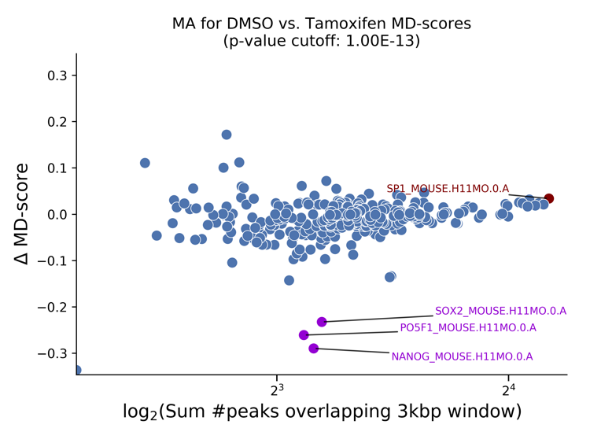
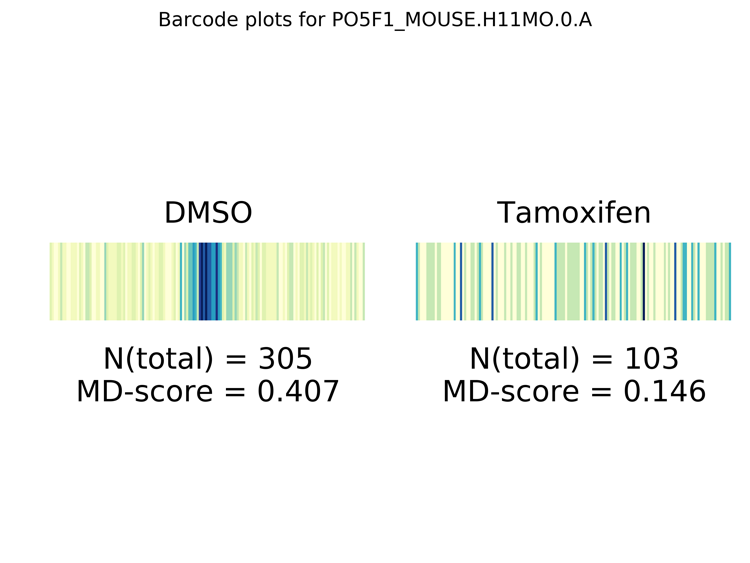

# DAStk

The Differential [ATAC-seq](https://www.ncbi.nlm.nih.gov/pmc/articles/PMC4374986/) Toolkit (DAStk) is a set of scripts to aid analyzing differential ATAC-Seq data. By leveraging changes in accessible chromatin, we can detect significant changes in transcription factor (TF) activity. This is a simple but powerful tool for cellular perturbation analysis.

You will need the following inputs:

- A pair of files listing peaks of ATAC-seq signal in two biological conditions (e.g. DMSO and drug-treated) in any BedGraph-compatible format (tab-delimited)
- A set of files listing the putative binding sites across the reference genome of choice, one file per transcription factor motif, also in any BedGraph-like format. These are normally generated from position weight matrices (PWMs) available at TF model databases like [HOCOMOCO](http://hocomoco11.autosome.ru).

### Install

You can install DAStk using `pip`:

    $ pip install DAStk

This is the simplest option, and it will also create the executable commands `process_atac` and `differential_md_score`. Alternatively, you can clone this repository by running:

    $ git clone https://biof-git.colorado.edu/dowelllab/DAStk

### Required Python libraries (can be installed thru `pip`):

* numpy
* argparse
* matplotlib
* scipy
* adjustText
* pandas
* multiprocessing

These scripts feature comprehensive help when called with the `--help` argument. Every argument provides a short and long form (i.e. `-t` or `--threads`), and can either be provided as input arguments or via a configuration file, depending on your preference. The are normally two steps in a typical workflow:

1. Process the ATAC-seq peak files to calculate the [MD-score statistic](https://genome.cshlp.org/content/28/3/334.short) for each motif provided.
2. Detect the most statistically significant changes in MD-score between both biological conditions, and generate MA and barcode plots.

### TL;DR;

If you satisfy all the Python library requirements, you can simply clone this repository and run `tf_activity_changes` with the following syntax:

    $ ./tf_activity_changes PREFIX CONDITION_1_NAME CONDITION_2_NAME CONDITION_1_ATAC_PEAKS_FILE \
      CONDITION_2_ATAC_PEAKS_FILE PATH_TO_MOTIF_FILES [NUMBER_OF_THREADS]

... then use `differential_md_score` (instructions below, or via `--help`) to explore which TFs are changing the most in activity for different p-value cutoffs.

### Usage examples

Unpack the motif files (see below for how to create your own, instead):

    $ mkdir /path/to/hg19_motifs
    $ tar xvfz motifs/human_motifs.tar.gz --directory /path/to/hg19_motifs

Calculate the MD-scores for the first biological condition:

    $ process_atac --prefix 'mcf7_DMSO' --threads 8 --atac-peaks /path/to/DMSO/ATAC/peaks/file \
      --motif-path /path/to/directory/containing/motif/files

The above command generates a file called `mcf7_DMSO_md_scores.txt`. The required prefix is a good way to keep track of what these new files represent. It's expected to be some sort of assay identifier and the biological condition, separated by a `_`; it's generally a good idea to use the cell type (or sample number) and a brief condition description (e.g. `k562_DMSO` or `SRR1234123_Metronidazole`). Alternatively, this could have been executed as:

    $ process_atac --prefix 'mcf7_DMSO' --threads 8 --config /path/to/config/file.py

... where the contents of this configuration file `file.py` would look like:

    atac_peaks_filename = '/path/to/DMSO/ATAC/peaks/file'
    tf_motif_path = '/path/to/directory/containing/motif/files'

We would then generate the same file, for the other condition we are comparing against:

    $ process_atac --prefix 'mcf7_Treatment' --threads 8 --atac-peaks /path/to/treatment/ATAC/peaks/file \
      --motif-path /path/to/directory/containing/motif/files

The above generates a file called `mcf7_Treatment_md_scores.txt`. Finally:

    $ differential_md_score --prefix mcf7 --assay-1 DMSO --assay-2 Treatment --p-value 0.0000001 -b

The above generates an MA plot that labels the most significant TF activity changes, at a p-value cutoff of 1e-7. Note that the condition names (DMSO and Treatment) were the same ones used earlier as the second half of the prefix. The plots look like the example below:

The `-b` flag also generates a "barcode plot" of each of these statistically significat motif differences that depicts how close the ATAC-seq peak centers were to the motif centers, within a 1500 base-pair radius of the motif center:

This entire process can be executed in this order by calling `tf_activity_changes`. If you can take advantage of multiprocessing, you can calculate MD-scores for both conditions simultaneously, assigning several threads to each, then generate the plots once both `*_md_scores.txt` files are ready.

### Motif Files

Feel free to use the motif files provided, [human_motifs.tar.gz](http://dowell.colorado.edu/pubs/DAStk/human_motifs.tar.gz) and [mouse_motifs.tar.gz](http://dowell.colorado.edu/pubs/DAStk/mouse_motifs.tar.gz) for the `hg19` and `mm10` reference genomes, respectively. They have been generated from HOCOMOCO's v10 mononucleotide model. To generate your own files for each motif, you can use FIMO in combination with the downloaded `.meme` files from your TF database of choice. For example, if using HOCOMOCO, you can create the motif file for TP53 using their mononucleotide model with a p-value threshold of 0.000001 by:

    $ fimo -max-stored-scores 10000000 --thresh 1e-6 -oc /path/to/output/directory -motif /path/to/motif/file \
      /path/to/HOCOMOCOv11_HUMAN_mono_meme_format.meme /path/to/whole_genome.fa

-----

Please cite DAStk if you have used it in your research!  
For any questions or bug reports, please use the Issue Tracker.

*Ignacio Tripodi (ignacio.tripodi at colorado.edu)*  
*Computer Science Department, BioFrontiers Institute*  
*University of Colorado, Boulder, USA*
